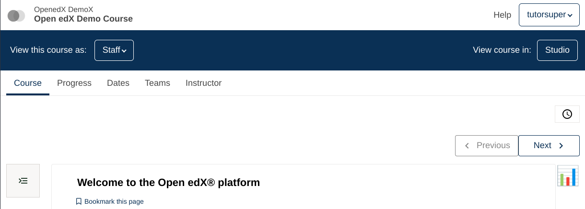

# Notifications Discussions Sidebar Slot

### Slot ID: `notifications_discussions_sidebar_slot`

## Description

This slot is used to replace/modify/hide the notifications discussions sidebar.

## Example



The following `env.config.jsx` will replace the notifications discussions sidebar.

```js
import { DIRECT_PLUGIN, PLUGIN_OPERATIONS } from '@openedx/frontend-plugin-framework';

const config = {
  pluginSlots: {
    notifications_discussions_sidebar_slot: {
      keepDefault: false,
      plugins: [
        {
          op: PLUGIN_OPERATIONS.Insert,
          widget: {
            id: 'custom_sidebar_component',
            type: DIRECT_PLUGIN,
            RenderWidget: () => (
              <h1>📊</h1>
            ),
          },
        },
      ]
    }
  },
}

export default config;
```
